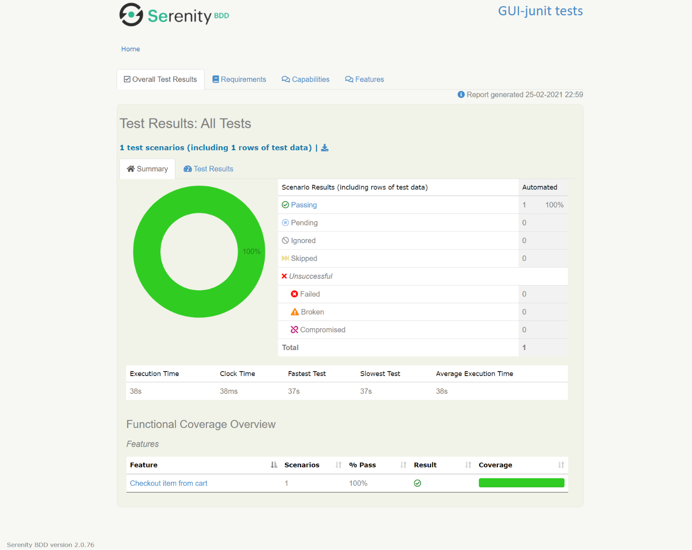

# GUIAutomation
Using Serenity-Selenium-Cucumber-Java
 
# Getting started with Serenity and Cucumber
Serenity BDD is a library that makes it easier to write high quality automated tests, with powerful reporting and living documentation features. It has strong support for both web testing with Selenium, and API testing using RestAssured.
* Clone this repository - gh repo clone gaurang053/GUIAutomation

# Prerequisite
* JAVA 8 or higher
* As Integrated Development Environment - Used Eclipse Version: 2020-12 (4.18.0)
* A Buid Tool - Used Maven

# How to install and run this project?
* Double click on execute.bat file present at root  or 
* or Execute maven command - mvn clean verify

# Goal: 
```
* To create a test automation framework skeleton for GUI Testing
* To use page object modeling approach
* To create demo for below use case
```

# Usecase implementation
```
Requirement:
• Open https://www.adidas.co.uk
• Search for the word "running" and from the opened page (PLP) click on the first product
• Verify that you have navigated to the correct product page by checking the URL
• Pick any size and click on "Add to Bag" button
• Verify that you have successfully added one item to the bag
• Click on "View Bag" button and navigate to the cart page
• Verify that you are on the cart page by the title "Your Bag"
• Then click on the Checkout button
• Verify that you're on the delivery page
• Then from the "Get Your Order" module, click "From A Collection Point"
• Then type "London" in the location text box
• Then click "Search for Collection Points" button
• Then from the list, pick any collection point
• Verify that correct collection point is selected
```

# How to write new tests ? 
```
* Step1. Create new feature file or Add Scenario (Outline, Given, When, Then) in a existing feature file with Valid Data 
* Step2. Add new methods with Given, When and Then Annotation in new/existing Step Defination class file. 
* Step3. Create a Page object methods and classes to build reusable code.
```

# Project Structure
```
src
  + main
  + test
    + java                                Test runners and supporting code
      + features                          Test Runner Class 
      + pages                             Page object method 
      + stepDefinition                    Write fature files mapping methods ( Business Logic)
    + resources
      + features                          Feature files
          + SampleOrder
      + webdrive                          exe file for chrome drive with linux, windows and mac platform
      + serenity.conf                     Serenity configuration files
		  
             record_a_new_trade.feature 
```


# Reference Test Report
Detailed HTML report is attached to the GIT location# https://github.com/gaurang053/GUIAutomation/blob/main/TestReport/site/serenity/index.html
Please download > Test Report > Site Folder



